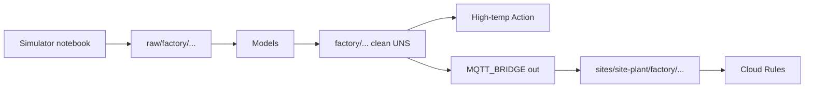

# Edge to Cloud Broker Bridge

Run the plant on an edge Coreflux broker that keeps working when the WAN drops, and forward a site-prefixed subtree to a cloud broker when the link returns. This is the multi-site federation pattern architects reach for first.

## What you will see

- Two machines publishing under `raw/factory/hall-a/...`, reshaped to clean `factory/hall-a/.../reading`
- After the bridge is up: the same payloads on the cloud broker under `sites/site-plant/factory/...`
- A high-temperature alert on the edge within about two minutes (`factory/hall-a/machine1/alert/high_temp`)
- Cloud Rules that let `bridge_site_plant` publish only under `sites/site-plant/#`, and let `dashboard_site` subscribe without publishing

## Architecture

## Included notebooks

| Notebook | Purpose | Target broker | When to run |
|---|---|---|---|
| `edge-cloud-bridge.lotnb` | Models, alert Action, local demo Route, cloud Rules | Edge, then cloud as noted by section | Every deployment |
| `edge-cloud-bridge-simulator.lotnb` | Independent two-machine raw data source | Edge | Hardware-free demo only |
| `edge-cloud-bridge-production.lotnb` | TLS bridge that replaces the local demo Route | Edge | Production when certificates and a real cloud endpoint are ready |

## Topic and data dictionary

| Topic | Payload example | Unit | Produced by |
|---|---|---|---|
| `raw/factory/hall-a/machine1/temperature` | `57.2` | °C | Simulator notebook or real device |
| `raw/factory/hall-a/machine1/state` | `running` / `idle` / `fault` | — | Simulator notebook or real device |
| `raw/factory/hall-a/machine1/id` | `machine1` | — | Simulator notebook or real device |
| `factory/hall-a/machine1/reading` | `{"site_id":"site-plant","temperature":57.2,"state":"running",...}` | °C in `temperature` | Model `HallAMachine1Reading` |
| `factory/hall-a/machine1/alert/high_temp` | text alert | — | Action when temp > 85 |
| `sites/site-plant/factory/hall-a/machine1/reading` | same JSON as clean reading | °C | Bridge remap on cloud |
| (machine2 mirrors machine1 under `.../machine2/...`) | | | |

## Quick start

1. From `compose/`, start both brokers: `docker compose up -d`. Edge is `localhost:1883` (HUB `http://localhost:8080`). Cloud is `localhost:1884` (HUB `http://localhost:8081`). Default image credentials follow your Coreflux image docs (often `root` / `coreflux` on fresh installs; change immediately).
2. On the **cloud** broker, create users (publish to `$SYS/Coreflux/Command`):
   - `-addUser bridge_site_plant <your-bridge-password>`
   - `-addUser dashboard_site <your-dashboard-password>`
3. Open `edge-cloud-bridge.lotnb`, connect to the **edge** broker, and run the Models and Actions sections.
4. Open `edge-cloud-bridge-simulator.lotnb` on the **edge** broker and run it top to bottom. Confirm `factory/hall-a/+/reading` updates in MQTT Explorer.
5. In `edge-cloud-bridge.lotnb` on the **edge** broker, replace `CHANGE_ME_BRIDGE_PASSWORD` in `EdgeToCloudBridge`, leave `BROKER_ADDRESS` as `coreflux-cloud` and port `1883`, then run the Route cell.
6. Reconnect `edge-cloud-bridge.lotnb` (or use a second window) to the **cloud** broker and run the Rules section.
7. On the cloud broker, subscribe to `sites/site-plant/#`. You should see remapped readings. On the edge, wait for an over-85 °C spike and confirm `.../alert/high_temp`.
8. **Pull-the-cable test:** `docker compose pause coreflux-cloud`, watch the edge keep publishing locally, then `docker compose unpause coreflux-cloud`. The bridge retries using `RECONNECTION_RETRIES`. Do **not** expect documented store-and-forward catch-up; that behavior is not in the MQTT Bridge docs.

## How it works

**Models** turn per-machine raw temperature, state, and id into one JSON reading under the clean factory UNS so dashboards and the bridge never consume `raw/...`.

**Actions** watch clean readings and publish a plain-language high-temp alert when temperature exceeds 85 °C, so the demo has an observable edge event without opening the cloud.

**Simulator notebook** drives two machines with a bounded temperature walk, periodic over-threshold spikes, and a running/idle/fault cycle onto the same raw topics a real ingress path would use. It has no dependency on solution definitions and is omitted in production.

**Routes** define an MQTT Bridge from the local broker (`BROKER SELF`) to the cloud destination, remapping `factory/#` to `sites/site-plant/factory/#` with `DIRECTION "out"`. Resilience is configured with documented `RECONNECTION_RETRIES` only. The production notebook supplies the mTLS replacement.

**Rules** (cloud only) isolate the site bridge user to `sites/site-plant/#` and give a dashboard user subscribe-only access to that subtree. Notebook order keeps Rules last for demo safety; production deploys them first.

## Production deployment

1. Do not run `edge-cloud-bridge-simulator.lotnb`.
2. On the cloud broker, create `bridge_site_plant` and `dashboard_site`, then run the solution notebook's Rules first.
3. On the edge broker, run the solution notebook's Models and Actions. Do not run its local demo Route.
4. Mount the CA and client certificates, set the real cloud host and secret placeholders in `edge-cloud-bridge-production.lotnb`, and run its TLS Route on the edge.
5. Verify the bridge account cannot publish outside `sites/site-plant/#`, then monitor Route logs and certificate expiry.

Rollback by disabling `EdgeToCloudBridgeTls` and restoring the last known-good Route definition. The production notebook is executable guidance; broader operations and security advice remains here.

## Adapting this template

1. **Site id** — replace `site-plant` in Model static fields, bridge `DESTINATION_TOPIC`, Rule topic patterns, and usernames (`bridge_<site>`, `dashboard_<site>`).
2. **Cloud host** — set `BROKER_ADDRESS` / `BROKER_PORT` / `USE_TLS` on the Route; never store `https://` in secrets (scheme belongs on the Route).
3. **Bridge credentials** — create per-site users on the cloud broker; put the password only in the Route cell or your secret process, not in git.
4. **Add another machine** — copy a Model cell in the solution notebook, change `machine3` in topics, and add matching Actions in the simulator notebook (or use a real device publishing the same raw topics).
5. **Add another site** — second edge broker, second bridge user, second Rule pair scoped to `sites/<other-site>/#`.

## Security notes

- Cloud Rules are the isolation boundary: a compromised edge bridge account must not write another site's namespace.
- `dashboard_site` is subscribe-oriented; its publish deny is priority 15 so it cannot inject into the site tree.
- Enable TLS and preferably mTLS for any non-lab WAN link (see the TLS Route cell). Provide cert paths via mounted volumes; do not embed PEMs in the notebook.
- Change default broker passwords before exposing ports beyond localhost.

## Known limitations

- **No documented store-and-forward** for `MQTT_BRIDGE`: no buffer size, QoS Route keys, or persistence-across-restart guarantees in the official plugin page. Offline story is reconnection retries only.
- Mid-session Rule effect on already-connected clients is not fully specified in docs; re-verify after deploying Rules.
- Dual-broker licensing for trial/community use is not spelled out in install docs; confirm with Coreflux before production multi-broker deployments.
- The solution notebook targets two brokers; follow the section-level broker labels when switching between edge and cloud.
