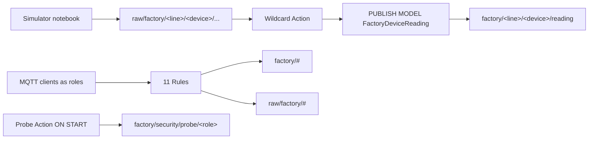
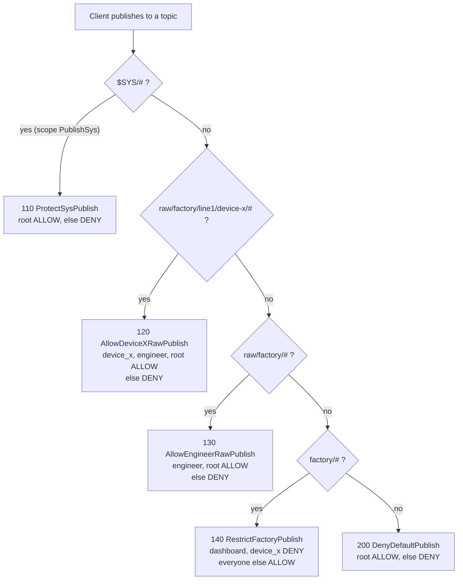
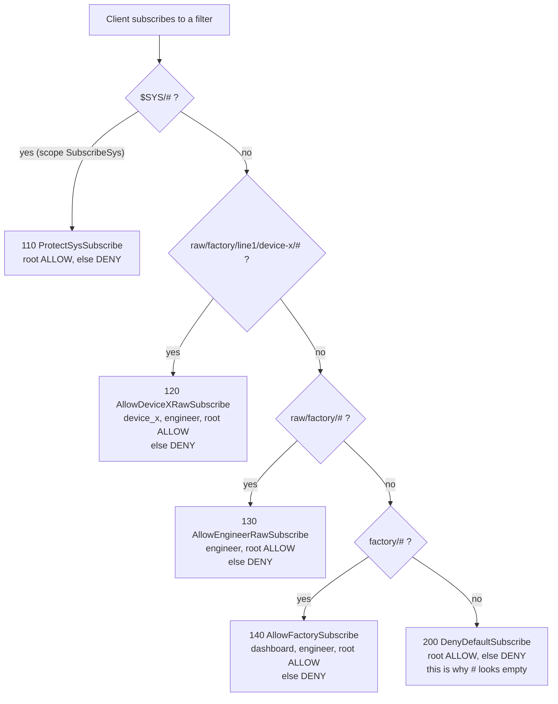
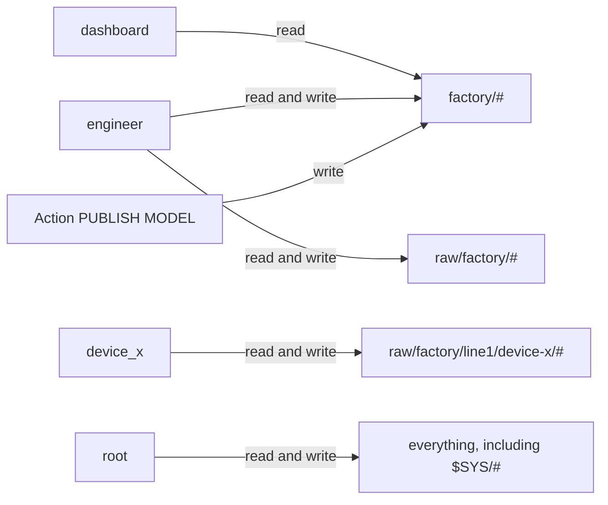

# Secure Your UNS in 11 Rules

## What this template does

Turn a small factory MQTT namespace into a deny-by-default access map: a dashboard that may only read the clean UNS, a device that may only read and write its own raw topics, and an engineer who may read and write both `raw/factory/#` and `factory/#`. Eleven Rules are the deliverable so IT/OT can take a PoC toward production with visible ALLOW and DENY outcomes. Publish and Subscribe rules that cover the same tree share a priority; overlapping patterns on the same operation still go specific-then-broad.

## What you will see

- Clean readings under `factory/line1/device-x/reading` and `factory/line1/device-y/reading` from one wildcard raw-to-clean Action
- A retained probe guide under `factory/security/probe/` with one topic per role, listing the expected allow and deny cases
- Live DENY when `dashboard` publishes, when `dashboard` subscribes to `raw/factory/#`, or when `device_x` touches the clean tree or another device's raw topics
- Live ALLOW when `device_x` writes its own raw subtree, or when `engineer` writes clean or raw factory topics
- Live ALLOW when `engineer` subscribes to `factory/#` and `raw/factory/#` (not `#`)
- Live DENY for any client that connects without credentials, because every Rule closes with `ELSE DENY`

## Architecture

## Included notebooks

| Notebook | Purpose | Target broker | When to run |
|---|---|---|---|
| `uns-security-starter.lotnb` | Model, probe Action, 11 Rules | Your Coreflux broker | Every deployment |
| `uns-security-starter-simulator.lotnb` | Independent raw device-x and device-y telemetry | Same broker | Hardware-free demo only |

## Infrastructure and assets

This template folder includes `compose/docker-compose.yml`, a single Coreflux broker for testing the Rules locally (MQTT on `localhost:1883`, HUB on `http://localhost:8080`), and `scripts/probe_access.py` to exercise ALLOW and DENY as the three role users. The Compose project is named `uns-security-starter`, so containers, network, and volume group under the template name in Docker rather than under the folder name. Associated GitHub repository: [https://github.com/CorefluxCommunity/coreflux-templates/tree/main/templates/building-blocks/uns-security-starter](https://github.com/CorefluxCommunity/coreflux-templates/tree/main/templates/building-blocks/uns-security-starter).

The Compose image is pinned to `coreflux/coreflux-mqtt-broker:2.14.3` (full image, not
distroless). That is the current versioned tag on Docker Hub as of 2026-08-26. The 0–99
system Rule reservation must still be verified against the broker you actually run.

Live behavioral testing for this template was done against a broker reporting
`2.14.3-rc.62`, which is where the `PUBLISH MODEL` rule-governance, anonymous-deny, and
default-priority findings in `VERIFICATION.md` come from. Confirm `$SYS/Coreflux/Version`
if you change the pin.

## Topic and data dictionary

| Topic | Payload example | Unit | Produced by |
|---|---|---|---|
| `raw/factory/line1/device-x/temperature` | `42.5` | °C | Simulator or real device (non-retained) |
| `raw/factory/line1/device-x/temperature_EU` | `celsius` | — | Simulator or real device (retained metadata) |
| `raw/factory/line1/device-x/id` | `device-x` | — | Simulator or real device (retained metadata) |
| `raw/factory/line1/device-y/temperature` | `38.0` | °C | Simulator (non-retained) |
| `raw/factory/line1/device-y/temperature_EU` | `celsius` | — | Simulator (retained metadata) |
| `raw/factory/line1/device-y/id` | `device-y` | — | Simulator (retained metadata) |
| `factory/<line>/<device>/reading` | `{"line_id":"line1","device_id":"device-x","temperature":42.5,...}` | unit in `unit` | Action `BuildFactoryDeviceReading` using Model `FactoryDeviceReading` |
| `factory/line1/device-x/cmd/setpoint` | `22` | application-defined | Engineer (or root) in negative tests |
| `factory/security/probe/dashboard` | expected access line | — | Action `PublishSecurityProbeGuide` (retained) |
| `factory/security/probe/device_x` | expected access line | — | Action `PublishSecurityProbeGuide` (retained) |
| `factory/security/probe/engineer` | expected access line | — | Action `PublishSecurityProbeGuide` (retained) |
| `factory/security/probe/source` | `PublishSecurityProbeGuide ON START` | — | Action `PublishSecurityProbeGuide` (retained) |

Engineering-unit and identity metadata are retained so `GET TOPIC` can resolve them
at any time, which is what lets the raw-to-clean Action stamp `unit` on every reading.
Measurements stay non-retained because each reading supersedes the last.

## Quick start

1. Start a broker. From `compose/`, run `docker compose up -d` (MQTT on `localhost:1883`, HUB on `http://localhost:8080`). Or use any existing Coreflux broker. Default lab credentials often follow the image docs (commonly `root` / `coreflux` on fresh installs; change immediately).
2. Create the three demo users **in Coreflux HUB** (sign in as `root`): **System** → **User Management**. Add `dashboard`, `device_x`, and `engineer` with passwords you choose. See [User management](https://docs.coreflux.org/latest/coreflux-hub/system/user-management). The LoT Notebooks extension in VS Code or Cursor does not replace this step. **Alternative:** MQTT `-addUser` on `$SYS/Coreflux/Command` ([broker commands](https://docs.coreflux.org/latest/mqtt-broker/commands)).
3. If upgrading an earlier deployed copy, remove obsolete entities in **HUB LoT Editor** (or delete them from the Coreflux sidebar in the LoT extension), then re-run the matching notebook cells. Names to remove: `DeviceXReading` (the generic Model has a different name), `AllowEngineerFactoryPublish` (rule 6 was renamed to `RestrictFactoryPublish`; leaving the old rule silences the clean UNS), `AllowDeviceXRawSubscribe`, `AllowEngineerRawSubscribe`, `AllowFactorySubscribe`, `DenyDefaultSubscribe` (priorities are now paired with the publish twins). Until `DenyDefaultSubscribe` is deployed, every role can read the whole broker by subscribing `#`. **Alternative:** `-removeModel` / `-removeRule` on `$SYS/Coreflux/Command`.
4. Deploy LoT from **[HUB LoT Editor](https://docs.coreflux.org/latest/coreflux-hub/lot)** or from the **[LoT Notebooks extension](https://docs.coreflux.org/latest/quick-start/vscode)** in VS Code or Cursor. Connect as `root`, open `uns-security-starter.lotnb` (or paste into the HUB tabs), run the Model, both Action cells, then all eleven Rule cells. Cells use `DEFINE MODEL` / `ACTION` / `RULE` with no `-add…` prefix. **Alternative:** MQTT `-addModel` / `-addAction` / `-addRule` ([getting started](https://docs.coreflux.org/latest/quick-start/getting-started) lists HUB, then the extension, then an MQTT client).
5. Open `uns-security-starter-simulator.lotnb` on the same broker and run it the same way (HUB LoT Editor or the LoT extension).
6. Verify in **Coreflux HUB**. Open `http://localhost:8080`, sign in as
   the role you are testing, then **MQTT** → **Data Viewer**. Subscribe the filters
   from the role catalog, not `#`: `root` may use `#`; `engineer` uses `factory/#`
   and `raw/factory/#`; `dashboard` uses `factory/#` only; `device_x` uses
   `raw/factory/line1/device-x/#`. Confirm `factory/line1/device-x/reading` and
   `factory/security/probe/` as expected for that user.
7. Optional: `python3 scripts/probe_access.py --dashboard-pass ... --device-x-pass ... --engineer-pass ...`
   (install `paho-mqtt` once). It prints yes/no for each listen check. Confirm writes
   in HUB Data Viewer as `root`.

Connect every client with a username and password, including HUB. This broker
accepts anonymous connections, and an anonymous session is denied by every Rule
here, which looks like an empty topic tree rather than an error.

**Alternative:** MQTT Explorer. Same credentials and the same filters. It often
defaults to `#`, which Rule 11 denies for everyone except `root`.

## Troubleshooting

**A topic tree looks empty after deploying the Rules.** Check who signed in and
which filter they subscribed. Verify in **Coreflux HUB** first.

1. Open `http://localhost:8080` (Docker compose default) and sign in as the username
   you are testing (`engineer`, `dashboard`, `device_x`, or `root`). HUB is an MQTT
   client: Rules apply to that identity.
2. Open **MQTT** → **Data Viewer**. Subscribe the granted filters from the role
   catalog. The Data Viewer can take a wildcard such as `factory/#`; a bare `#` is
   denied for everyone except `root` (Rule 11).
3. You should see live readings under `factory/.../reading` and the retained probe
   lines under `factory/security/probe/` when that user is allowed to subscribe them.

**HUB as `engineer` or `dashboard` shows nothing.** The session subscribed `#` (or
signed in without credentials). That is deny-by-default working, not a missing
grant. Subscribe the filters from the role catalog: `engineer` uses `factory/#` and
`raw/factory/#`; `dashboard` uses `factory/#` only; `device_x` uses
`raw/factory/line1/device-x/#`. Sign out and sign in again after changing user.

**Alternative: MQTT Explorer** (or any other MQTT GUI). Use the same username,
password, and filters. Those clients often subscribe to `#` by default, which Rule
11 denies for everyone except `root`. Replace `#` with the catalog filters.

The broker also allows anonymous connections (`AnonymousLogin` is true by default),
so a client with no credentials connects normally and is then denied by every
`ELSE DENY` branch. HUB Data Viewer and other MQTT clients show that as a silent
empty tree, not an error. Verified on broker 2.14.3-rc.62: with the clean-tree
subscribe Rule active, `root` and `dashboard` receive messages on `factory/#`,
while an unsigned-in session sees nothing. Reproduce it in HUB by opening Data
Viewer without signing in, or by signing in as `engineer` and subscribing `#`.

**The clean tree is silent while `raw/factory/#` still flows.** A `Publish` Rule over
`factory/#` is denying the Action's own output. `PUBLISH MODEL` is subject to `Publish`
Rules under an identity that matches no `USER IS` condition, so an allow-list over the
clean tree silences it. Rule 6 ships as a deny-list for this reason; converting it to
an allow-list reproduces the failure. Verified: with an allow-list on `factory/#` the
readings were 0 in 13 seconds, and removing that rule restored 6 in 13 seconds.

Raw ingress from the simulator is never the cause: `PUBLISH TOPIC` inside an Action is
not rule-governed.

**A reading carries a field the Model no longer has.** A running wildcard Action
instance can keep the Model shape it was created with. Remove and re-add the Action
after changing a Model, or restart the broker.

**A Rule appears to do nothing.** Read `$SYS/Coreflux/Rules/` and compare priorities.
Broker defaults currently sit at 1, 10, and 1000000, so a default at priority 10 wins
over a user Rule at 100 for the same scope. See **Security notes**.

## How it works

**Models** define one reusable `FactoryDeviceReading` JSON shape. It is `COLLAPSED`, so it does not subscribe or publish by itself.

**Actions** use `BuildFactoryDeviceReading` to watch `raw/factory/+/+/temperature`, extract line and device from the triggering topic, read the matching retained `temperature_EU`, and `PUBLISH MODEL` to `factory/<line>/<device>/reading`. New matching lines and devices need no new clean-UNS entity. `PublishSecurityProbeGuide` runs `ON START`, so deploying it (and every later broker start) refreshes the retained access-test checklist under `factory/security/probe/`.

**Simulator notebook** publishes plausible device-x and device-y raw telemetry. It does not impersonate role users; DENY visibility comes from HUB sessions as each role, or from `scripts/probe_access.py`.

**Rules** implement the three-role catalog as deny-by-default, then per-role grants.
Publish and Subscribe are different operations, so each topic layer uses one
priority for both directions: `$SYS` at 110, device-x raw at 120, engineer raw at
130, clean factory at 140, deny-by-default catch-alls at 200. Overlapping patterns
on the same operation still go specific-then-broad (120 before 130). Priorities
0–99 are reserved for broker system Rules. Every rule closes with `ELSE`. Notebook
order keeps Rules last for demo safety; production deploys them first.

Language and evaluation order: [Rules overview](https://docs.coreflux.org/latest/lot-language/rules/overview) and [Rules syntax](https://docs.coreflux.org/latest/lot-language/rules/syntax). Role model: [RBAC](https://docs.coreflux.org/latest/lot-language/rules/rbac). Deploy Rules in [HUB LoT Editor](https://docs.coreflux.org/latest/coreflux-hub/lot) or by running notebook cells in the [LoT Notebooks extension](https://docs.coreflux.org/latest/quick-start/vscode) (VS Code or Cursor). MQTT `-addRule` / `-removeRule` is an alternative ([broker commands](https://docs.coreflux.org/latest/mqtt-broker/commands)).

The two entity publish forms are governed differently, verified on 2.14.3-rc.62:

| Entity operation | Subject to `Publish` Rules |
|---|---|
| `PUBLISH TOPIC` inside an Action (the simulator's raw output) | No |
| `PUBLISH MODEL` inside an Action (the clean readings) | Yes |

Because the `PUBLISH MODEL` identity matches no `USER IS` condition, rule 6 over
`factory/#` is a deny-list (`THEN DENY ELSE ALLOW`) rather than an allow-list. An
allow-list there denies the Action's own output and the clean UNS goes silent. Every
other topic rule stays an allow-list. The trade-off is that unauthenticated publishes
on `factory/#` are allowed, which is why disabling anonymous login is a requirement
rather than optional hardening.

### Rule decision flow

The broker walks the rules for one operation in priority order and stops at the
first rule whose scope and topic pattern match the request. That rule's `ALLOW` or
`DENY` is the answer, so there is no fall-through to a later rule.

Matching uses the topic filter the client literally sends. A client asking for
`raw/#` matches none of the `raw/factory/...` patterns and lands on the
deny-by-default catch-all.

Publish path:

Subscribe path, same layers and same priority numbers:

Resulting access map:

`engineer` has no edge to `#`, which is the whole point of the catch-all: the grant
is the two named trees. In Coreflux HUB Data Viewer (or MQTT Explorer as an
alternative), subscribe `factory/#` and `raw/factory/#` rather than `#`.

## Production readiness

Operator checklist for taking the demo to a real environment.

### Remove simulator

- Do not run `uns-security-starter-simulator.lotnb`.
- Point real devices at `raw/factory/<line>/<device>/{temperature,temperature_EU}`. No Model or Action edits are required for another matching line or device. Device-specific Rules may still need extending.

### Deploy Rules first

- Create role users in HUB **User Management**, deploy all eleven Rules from HUB **LoT Editor** or the LoT Notebooks extension, then deploy Models and Actions the same way.
- Contrast: the solution notebook puts Rules last so a mid-notebook deny set cannot lock the deploying identity out of remaining demo cells.
- MQTT `-addUser` / `-addRule` is an alternative, not the primary path.

### Credentials and secrets

- Demo uses passwords you choose in HUB User Management (or `-addUser` as an alternative); do not commit them.
- No Route secrets in this template. If you later add Routes, use `GET SECRET` / `GET ENV` and never store `https://` or any `//` in the secret store.
- Prefer strong unique passwords per role; rotate after the lab.

### TLS and network exposure

- TLS and mTLS transport setup are out of scope for this template. Before leaving the lab, enable broker TLS (or terminate TLS at a gateway) and firewall MQTT ports to known clients.
- Do not expose plaintext `1883` beyond localhost without a compensating control.

### Retention

- `PUBLISH MODEL` readings are structured, non-retained events for active subscribers. Add a documented retention strategy if production dashboards must receive the latest reading immediately after reconnect.
- Probe guide topics use `KEEP TOPIC`, so the expected access map is retained and a client that connects later still receives it.
- Device metadata (`temperature_EU`, `id`) is retained on purpose: the raw-to-clean Action reads it with `GET TOPIC`, and a real device should publish its metadata retained for the same reason.
- Simulator `sim/...` state uses `KEEP TOPIC` (retained internal state); do not treat `sim/...` as part of the clean UNS.

### Monitoring and dead-letter topics

- N/A for outbound REST. For access control, monitor failed client authentications and unexpected empty publishes during go-live tests; keep a retained copy of your Rule set in source control.

### Template-specific hardening

- Replace `USER IS` demo usernames with `USER HAS` permission tags once your user-management process assigns tags reliably.
- The subscribe catch-all already ships (`DenyDefaultSubscribe`, priority 200, paired with `DenyDefaultPublish`). Keep it. If admin tooling is not `root`, add `OR USER HAS AllowedSystemConfiguration` rather than deleting the Rule.
- Add tenant isolation Rules if you need a second bounded context; that story is a README adaptation, not extra demo users.
- Give every rule an explicit `ELSE`. A rule without one does not compile, and a rule
  whose scope and topic match always decides the outcome, so never rely on fall-through.
- **When adding a rule, place it by topic breadth on that operation.** More specific than an existing rule on the same operation means a lower number; broader means a higher number. A publish rule and a subscribe rule for the same tree should share a number. A broad rule with too low a number on the same operation silently shadows every specific rule beneath it.
- Never assign priorities 0–99 to user Rules. Start specific user protection at 100
  and use larger numbers for progressively broader fallbacks.
- **Disable anonymous login.** The broker ships `AnonymousLogin` enabled, so an
  unauthenticated client can still connect and consume a session before every Rule
  denies it. Turn it off so unauthenticated clients are rejected at connect time
  rather than silently denied per operation.
- Verify your broker's default Rule set before trusting a user Rule: read
  `$SYS/Coreflux/Rules/`. On 2.14.3-rc.62 the defaults sit at priorities 1, 10, and
  1000000, so a default at 10 decides user-management and `$SYS` operations before a
  user Rule at 100 is consulted.
- Keep rule 6 (`RestrictFactoryPublish`) as a deny-list. Rewriting it as an allow-list
  denies the Action's own `PUBLISH MODEL` and silences the clean UNS.
- Do not expect Rules to constrain an Action's `PUBLISH TOPIC` output; that form is not
  rule-governed. Control it in the Action itself.
- Reconnect MQTT clients after Rule deploy. New subscriptions are evaluated against
  new Rules; re-evaluation of already-open subscriptions is unverified.
- **Editing a Rule:** remove it first, then add the new definition. Delete the Rule in **HUB LoT Editor** (or the LoT extension sidebar) and re-run the cell. Re-running an edited Rule cell without a remove is a silent no-op: the add fails on an existing name (`A rule with the name '<name>' already exists`) and the old Rule keeps deciding. Models and Actions do overwrite on re-add. **Alternative:** `-removeRule` then `-addRule` on `$SYS/Coreflux/Command`; confirm `"success":true` on `$SYS/Coreflux/Command/Output`.
- **A narrow Rule shadows the broader Rules behind it**, so it must re-list every identity
  the broader Rules grant. Rules 4 and 7 name `engineer` and `root` for this reason.
  Verified: dropping `engineer` from rule 4 stopped engineer writing to the device-x
  subtree even though rule 5 still granted `raw/factory/#`.
- Rollback: delete the Rule in HUB LoT Editor or the LoT extension. **Alternative:** `-removeRule <RuleName>` per rule. Avoid `-removeAll*` unless you intentionally wipe the broker.

## Adapting this template

1. **Another device:** publish `temperature` and `temperature_EU` under `raw/factory/<line>/<device>/`; the wildcard Action creates its clean reading automatically. Add or generalize device Rules separately, and **copy `engineer` and `root` into any device-scoped rule you add**: a narrow rule shadows the broader `raw/factory/#` rules, so a device rule naming only its own device silently revokes engineer's access to that subtree. Stay at two or three named users in the gallery copy.
2. **Another line:** use the same raw contract under `raw/factory/<new-line>/<device>/`; no Model or Action copy is needed. `raw/factory/#` and `factory/#` already cover the engineer, while a device-specific Rule may need another prefix.
3. **Tenant isolation:** add publish and subscribe Rules for `tenants/a/#` and `tenants/b/#` at a number below 200. Prefer permission tags so you do not grow the username catalog.
4. **Permission tags instead of usernames:** change conditions to `USER HAS DeviceXWrite` (and so on) after tags are assigned in HUB or users JSON.
5. **Widening admin read access:** rule 11 allows only `root` to subscribe outside the two factory trees. If admin tooling connects as another identity, add `OR USER HAS AllowedSystemConfiguration` to that rule rather than removing it. Never use the system-reserved 0–99 range.
6. **Revoking a role's write access:** on an allow-list rule, remove that username from
   the list, then remove the Rule in HUB LoT Editor (or the LoT extension) and re-add so the change actually deploys. MQTT `-removeRule` is an alternative. Check every
   narrower rule too: removing a name from `raw/factory/#` does not affect the device
   subtrees, which are decided by their own rules. On rule 6, which is a deny-list, add
   the username to the deny condition.
   Never add a separate deny-only rule: those do not compile, and a broad deny rule
   would shadow the specific allows beneath it.
7. **Another writer on the clean tree:** rule 6 allows anyone not named in its deny
   condition, so a new writer needs no rule edit. Add roles that must *not* write
   there to the deny condition instead.

## Security notes

The demo Rules enforce: dashboard subscribe-only on `factory/#`; `device_x` confined to `raw/factory/line1/device-x/#`; engineer read/write on `factory/#` and `raw/factory/#`; `$SYS` and user creation restricted to `root`; every other standard-topic publish denied except `root`. Dashboard read-only comes from the factory subscribe allow-list plus absence from every publish allow-list, plus the `#` publish catch-all. See **Production readiness** for go-live order, TLS, and hardening beyond the lab. Syntax and scopes: [Rules syntax](https://docs.coreflux.org/latest/lot-language/rules/syntax). Overview: [Rules overview](https://docs.coreflux.org/latest/lot-language/rules/overview).

| Risk | Mitigating rule(s) |
|---|---|
| Anyone creates broker users | `RestrictUserManagement` (priority 100) |
| Non-admin publishes or subscribes on `$SYS/#` | `ProtectSysPublish`, `ProtectSysSubscribe` (priority 110) |
| Dashboard publishes anywhere | `RestrictFactoryPublish` (140) denies it by name; `AllowEngineerRawPublish` (130) and `DenyDefaultPublish` (200) deny it by `ELSE` |
| Dashboard reads raw ingress | `AllowEngineerRawSubscribe` (130) denies it by `ELSE` |
| Device publishes or reads another device's raw topics | `AllowEngineerRawPublish` (130) / `AllowEngineerRawSubscribe` (130) deny by `ELSE`, with `DenyDefaultSubscribe` (200) closing the broader `raw/#` and `#` filters |
| Device writes or reads the clean UNS | `RestrictFactoryPublish` (140) denies it by name; `AllowFactorySubscribe` (140) denies by `ELSE` |
| Engineer writes outside factory raw and clean trees | `DenyDefaultPublish` (priority 200) |
| Unauthorized subscribe on the clean factory tree | `AllowFactorySubscribe` (priority 140) |
| Any client escapes its subscribe scope by asking one level broader (`raw/#`, `#`) | `DenyDefaultSubscribe` (200). Verified: without it, `device_x` on `raw/#` read device-y telemetry and on `#` read the whole clean tree |
| Unauthenticated client reads or writes anything | Nine rules' `ELSE DENY` branch; an anonymous session matches no `USER IS` condition (empty tree in Data Viewer). **Not** covered on `factory/#` publish, where rule 6 must allow the Model's identity. Disable anonymous login to close it |

Two Rules in this table do not decide anything on broker 2.14.3-rc.62:
`RestrictUserManagement` (100) and `ProtectSysSubscribe` (110) are pre-empted by the
broker defaults `AllowUserCreation` (10) and `AllowSubscribeSysClient` (10), which
already restrict those operations to privileged identities. They ship because they
state the intended policy and become the deciding Rules once defaults occupy the
reserved 0–99 band. Confirm against `$SYS/Coreflux/Rules/` on your own broker.

Two constraints shape this set:

- **Every rule closes with `ELSE`.** `IF ... THEN DENY` with no `ELSE` leaves the block
  unclosed and does not compile. Published doc examples still show `ELSE`-less rules;
  do not copy them.
- **A matching rule always decides.** Since every rule returns a verdict, the first rule
  whose scope and topic pattern match produces the outcome, and there is no fall-through
  for a non-matching condition. So rules are ordered most specific topic first
  (lowest number) to broadest catch-all last (highest number).

The next broker version reserves priorities **0–99** for system Rules. User-authored
Rules must start at **100**. Because lower numbers evaluate first, priority 100 is the
highest priority available to users.

A fresh Coreflux broker already applies default behaviors: `root` has full access,
management operations require permission tags, standard topics are open, and `$SYS`
is restricted. These defaults are behaviors, not named Rules, and there are no
reserved Rule names to collide with. The next broker version separately reserves
priorities 0–99 for system Rules, so every Rule in this template uses 100 or higher.
System Rules always evaluate before user Rules and cannot be overridden by them.
Rules 1 to 3 express the intended user-policy baseline for operations left to user
Rules; rules 4 to 10 provide the factory raw and clean topic policy. Verify the released
system Rule set to confirm which operations reach user policy.
